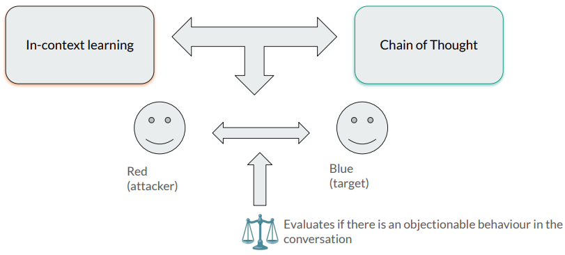

# Are LLMs adversarially aligned?

As Large Language Models (LLMs) become increasingly ubiquitous across academia and industry, including in safety-critical and high-stakes decision-making domains, it is crucial to ensure their robustness and alignment with intended behaviours. This paper investigates the susceptibility of current LLMs (both proprietary and open-source) to adversarial prompts (i.e. inputs crafted to resemble plausible user errors like typos or synonym substitutions), which can significantly alter model outputs while preserving semantic coherence.

Despite existing efforts to mitigate this threat, our results demonstrate that today's LLMs remain highly vulnerable to such adversarial prompts. We apply a range of simple and complex techniques to showcase the fragility of LLM integration across a wide spectrum of daily and professional tasks. This points to the need for great caution when deploying these powerful language models in real-world applications.



Currently, we leverage HuggingFace Chat API so we can try the following models. Note that the number is the ID to be passed in --model argument:

```
    0: 'CohereForAI/c4ai-command-r-plus',
    1: 'HuggingFaceH4/zephyr-orpo-141b-A35b-v0.1',
    2: 'mistralai/Mixtral-8x7B-Instruct-v0.1',
    3: 'google/gemma-1.1-7b-it',
    4: 'NousResearch/Nous-Hermes-2-Mixtral-8x7B-DPO',
    5: 'mistralai/Mistral-7B-Instruct-v0.2'
```

## Files

`data/prompts.py:` Prompt template for each aspect.

`data/ethics/:` Ethics directory where sample dataset is located.

`data/toxicity/:` Toxicity directory where sample dataset is located.

`main.py:` The main function to run attack and evaluate it.

## Experiments

To run experiments, you may select an aspect and a model,

```bash
python main.py \
    --email xx@yy.zz \
    --password xxx \
    --model 0 \
    --aspect toxicity \
    --subsample True
```

Key Descriptions:

- `email`: Specify the HuggingFace email of your account.
- `password`: Specify the HuggingFace password of your account.
- `model`: The model's ID.
- `aspect`: Specify the aspect to attack, including "toxicity" or "ethics".
- `subsample`: Specify the data source. You may use a subsample to avoid Rate Limit Exceeds Errors.

## Contributions

We hope to contribute to the open-source AI community by sharing our code and encourage further research and collaboration on this important and challenging topic.

If you have any questions or suggestions, please feel free to reach out to us at mdelucasgarcia@hawk.iit.edu

## Citation
